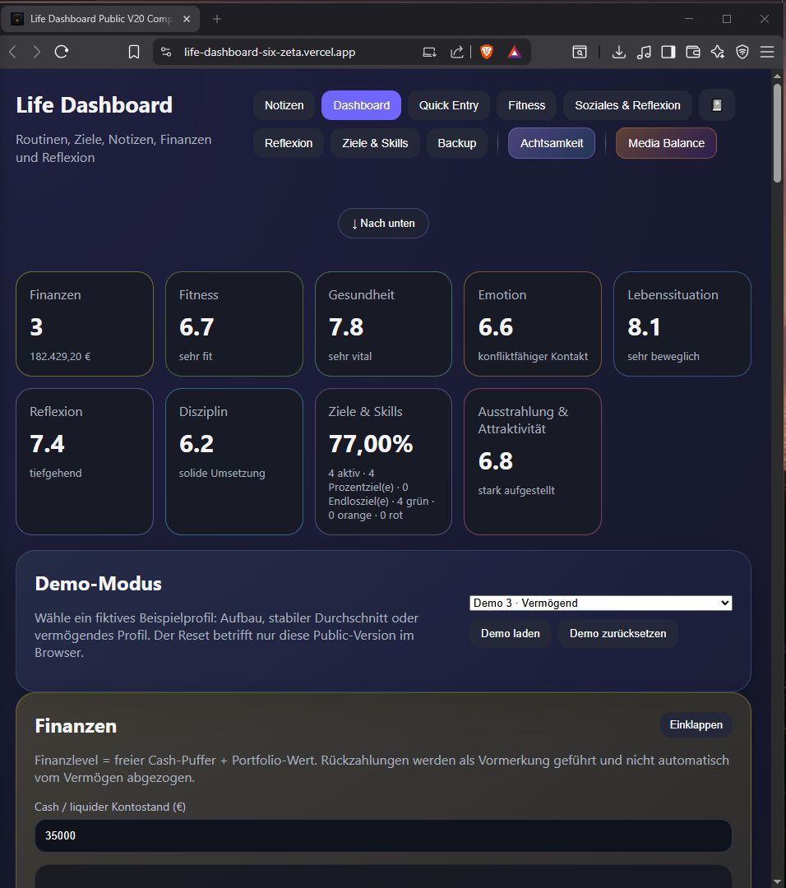
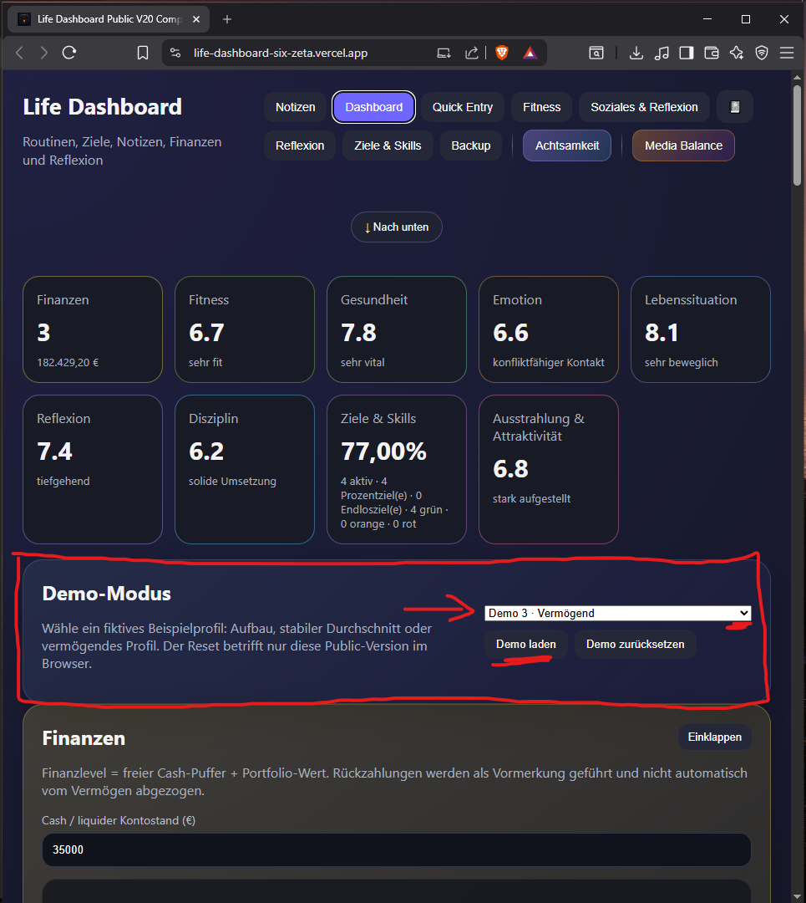
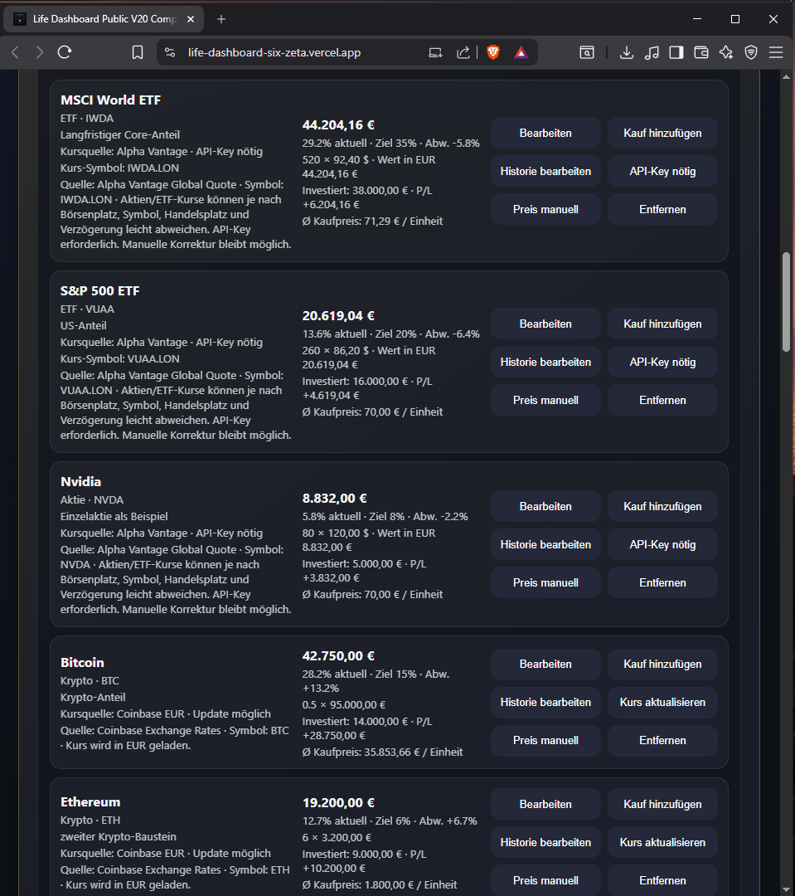
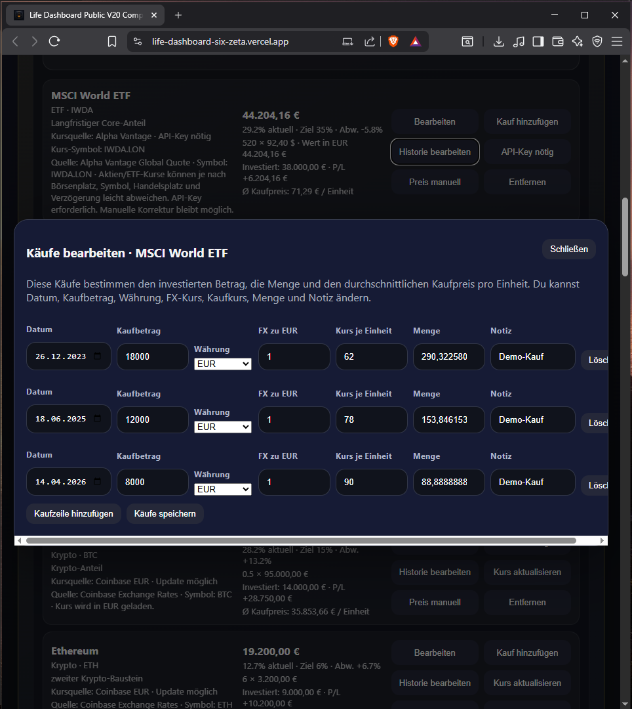
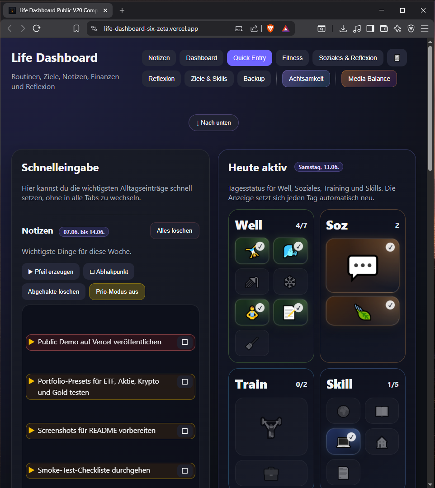
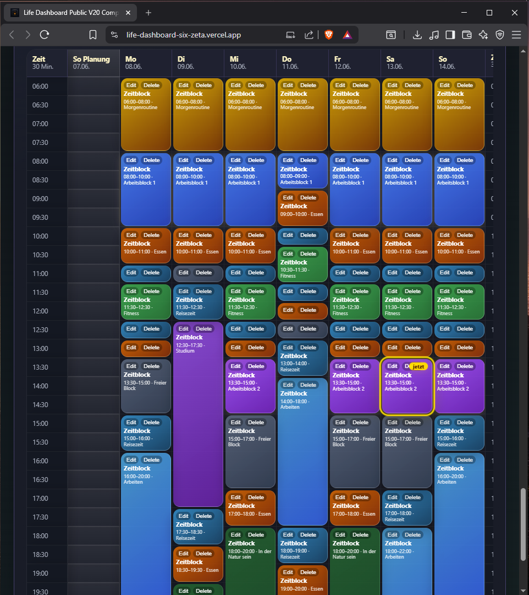
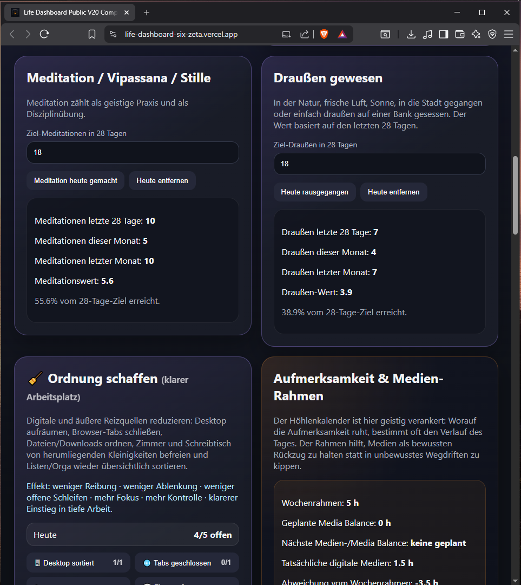
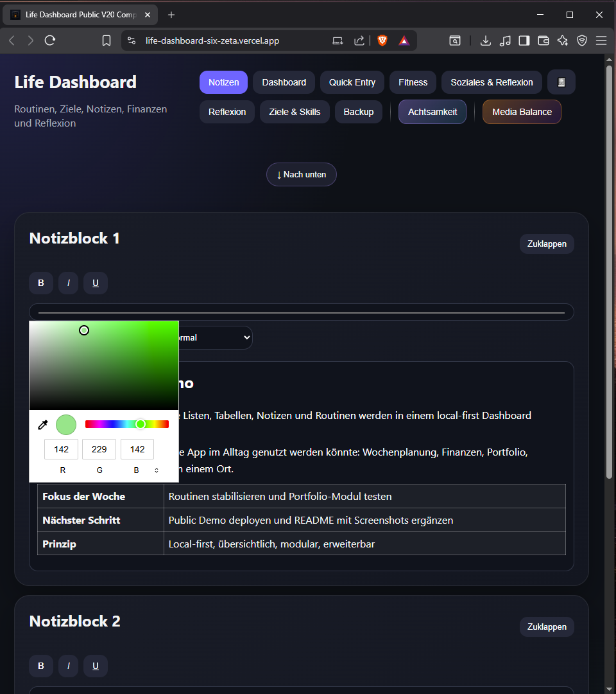
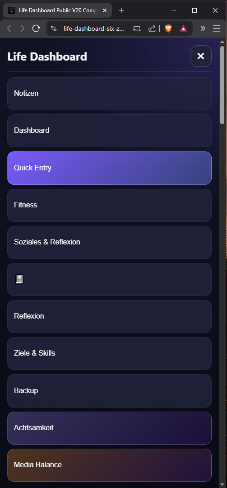
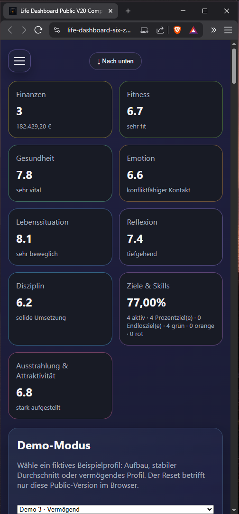

# Life Dashboard

**Live Demo:** https://life-dashboard-six-zeta.vercel.app

A modular, local-first personal dashboard for notes, routines, goals, reflection, finance and portfolio tracking.

This is the public portfolio version of a private dashboard project. It uses fictional demo data and separate public storage keys so it can be shown safely on GitHub and as a live demo.

> Status: public demo / portfolio project. Not financial advice. Not a medical product.

---

## Preview

### Dashboard overview



### Demo mode



### Portfolio module



### Purchase history editor



### Quick entry



### Weekly planning



### Skills and reflection



### Notes



### Mobile layout



### Mobile layout



---

## Why I built this

I originally built this because I personally needed a better place for things that were scattered across many different tables, notes, lists and trackers.

The goal was not to build a generic productivity clone. The goal was to make one flexible system where daily planning, self-reflection, routines, finance, portfolio tracking, media balance and long-term goals can live together.

This public version shows the idea in a safe, demo-friendly form.

---

## Demo mode

The public demo includes three fictional profiles:

- **Demo 1 · Aufbau** – starter profile with a smaller portfolio and early routines
- **Demo 2 · Stabil** – balanced average profile
- **Demo 3 · Vermögend** – larger portfolio and stronger routine history

New visitors start with an empty local state. Demo data is fictional, loaded only after choosing a profile, and only affects the visitor's local browser storage.

---

## Public launch readiness

This repository includes the core material needed for a portfolio-friendly public release:

- live demo link
- README with screenshots
- project motivation
- architecture documentation with Mermaid diagrams
- roadmap and known limitations
- setup instructions
- local smoke check via `npm run check`

The optional demo video/GIF is intentionally not required for this release.

## Core features

### Dashboard

- overview scores
- modular sections
- mobile-friendly navigation
- demo mode with multiple fictional profiles

### Notes and quick entry

- rich note fields
- project notes
- weekly task list
- priority mode
- lightweight daily planning

### Goals, skills and routines

- percentage-based goals
- daily click tracking
- active/inactive goal states
- health sliders
- life situation sliders
- emotion/social practice
- reflection/mind sliders
- discipline score based on rolling routine history

### Finance and portfolio

- cash balance
- flexible portfolio assets
- asset presets
- manual price editing
- optional live price updates
- purchase history per asset
- structured add-purchase flow for existing assets
- invested amount vs current value
- average buy price
- target share per asset

---

## Market data

Supported automatic quote sources:

| Asset type | Status |
|---|---|
| BTC / ETH / SOL | automatic via Coinbase EUR rates |
| Gold / Silver | automatic via Gold API USD prices |
| Selected stocks | optional via Alpha Vantage API key |
| Selected ETFs | optional via Alpha Vantage API key |
| FX rates USD/CHF/GBP to EUR | optional automatic lookup with fallback values |
| Cash | fixed / manual |
| Real estate | manual |
| Bonds | manual |
| Custom assets | manual |

Manual price editing is always available. Existing assets can receive additional purchase entries through the global **Nachkauf eintragen** flow. FX values can be refreshed from a public no-key exchange-rate endpoint and fall back to bundled demo defaults if the request fails.

Stock and ETF quotes may differ from broker prices depending on ticker symbol, exchange, currency, delayed data and bid/ask spread.

No real API key is included in this public project.

---

## Architecture

The technical architecture is documented with Mermaid diagrams in:

```text
docs/architecture.md
```

The public demo runs as a static frontend on Vercel and stores demo data locally in the visitor's browser.

---

## Local-first data model

The app stores data in the browser by default.

Public storage keys:

```text
modularLifeDashboardPublicData
modularLifeDashboardPublicEmergencyBackup
modularLifeDashboardPublicLastActiveTab
modularLifeDashboardPublicDemoProfile
modularLifeDashboardPublicAlphaVantageKey
modularLifeDashboardPublicFxRates
```

The public version intentionally does not migrate from private storage keys.

For the public demo, no backend is required. GitHub + Vercel are enough to show the project online.

---

## Quick start

No build step is required.

```bash
npm run start
```

or directly:

```bash
python3 -m http.server 8000
```

Then open:

```text
http://localhost:8000
```

Run the full local check:

```bash
npm run check
```

This runs JavaScript syntax validation plus a small smoke check for public-release safety.

---

## Project structure

```text
.
├── index.html
├── style.css
├── app.js
├── manifest.webmanifest
├── service-worker.js
├── docs/
├── screenshots/
├── scripts/
└── package.json
```

---

## Documentation

| File | Purpose |
|---|---|
| `docs/architecture.md` | technical architecture overview with Mermaid diagrams |
| `docs/setup.md` | local setup instructions |
| `docs/demo-mode.md` | demo profiles and demo data |
| `docs/market-data.md` | market data sources and limitations |
| `docs/screenshots.md` | screenshot checklist |
| `docs/privacy.md` | privacy and public-version notes |
| `docs/deployment.md` | GitHub/Vercel deployment notes |
| `docs/public-release-checklist.md` | public release checklist |
| `docs/license-explained.md` | plain-language license explanation |

---

## Privacy notes

This public version is designed to be safe for demonstration:

- fictional demo data only
- separate public localStorage keys
- no private data migration
- no real API keys committed
- no backend required for the demo
- manual reset/demo reset available

---

## Known limitations

- This is not financial advice.
- Quote sources can be delayed or differ from broker execution prices.
- Stock and ETF support depends on API key and provider symbol availability.
- No multi-user collaboration.
- Automated tests are still limited.
- FX and quote data depend on external public APIs and can fall back to manual/default values.

---

## Roadmap

Possible next polish steps:

- add a custom Vercel domain
- improve mobile screenshots
- refine stock/ETF symbol mapping after real-world testing
- prepare a short LinkedIn/project description
- optionally add more automated checks
- split the large `app.js` and `style.css` files into smaller modules

---

## License

MIT. See `LICENSE` and `docs/license-explained.md`.
