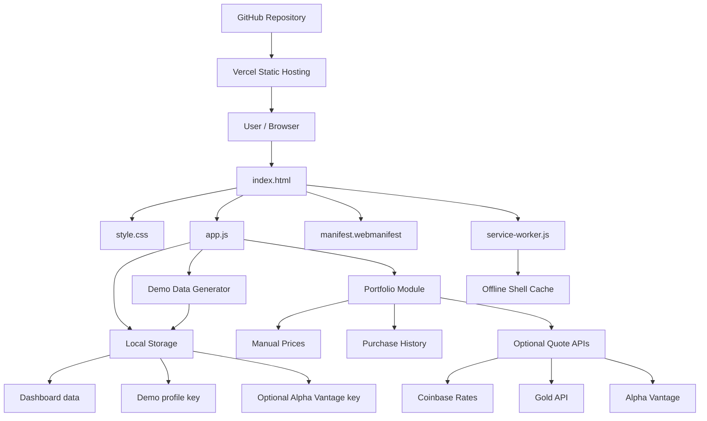
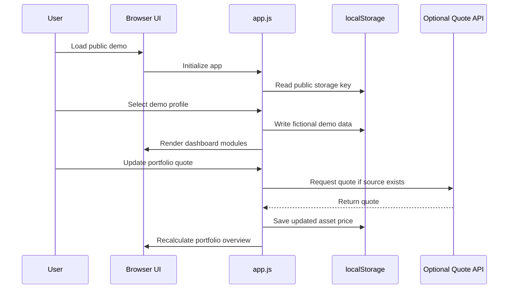

# Architecture

Life Dashboard is a local-first, browser-based portfolio/demo application.

It is intentionally simple: a static frontend, browser storage and optional external quote APIs. Optional backend is not required for the public demo.

## System overview



## Data flow



## Main files

| File | Purpose |
|---|---|
| `index.html` | static app shell and sections |
| `style.css` | responsive UI and visual system |
| `app.js` | state model, rendering, persistence and module logic |
| `manifest.webmanifest` | PWA metadata |
| `service-worker.js` | offline shell cache |
| `README.md` | public project presentation |
| `docs/` | technical and project documentation |
| `screenshots/` | README screenshots |

## Public storage keys

```text
modularLifeDashboardPublicData
modularLifeDashboardPublicEmergencyBackup
modularLifeDashboardPublicLastActiveTab
modularLifeDashboardPublicDemoProfile
modularLifeDashboardPublicAlphaVantageKey
```

The public version intentionally does not migrate from private dashboard storage keys.

## Deployment model

```text
GitHub
→ Vercel static deployment
→ Demo data in visitor's browser storage
```

No backend is required for the public demo.

## Optional integrations

| Integration | Required for public demo? | Purpose |
|---|---:|---|
| Optional backend | No | Optional future cloud sync |
| Coinbase | No | Optional crypto price updates |
| Gold API | No | Optional gold/silver price updates |
| Alpha Vantage | No | Optional stock/ETF quotes with user-provided API key |

## Backup format

The public backup envelope is documented in `docs/backup.md`.
